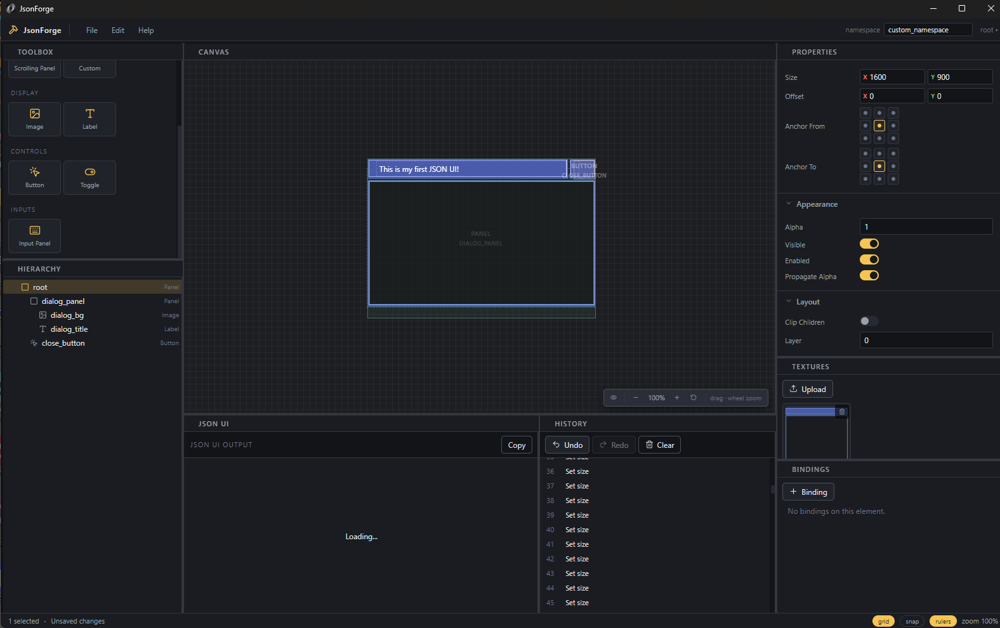

<div align="center">

# JsonForge

**Visual JSON UI editor for Minecraft: Bedrock Edition.**



<sub>Web + Electron · MIT licensed · open source</sub>


</div>

---

## What it is

JsonForge is a visual editor that lets you build Minecraft Bedrock JSON UI
screens with a dockable interface - drag elements onto a
canvas, tweak properties, drop in textures, export valid JSON UI for your
resource pack. It runs in any modern browser **and** as a native desktop
application via Electron, from a single codebase.

## Features

- **10 element types** out of the box - `panel`, `stack_panel`,
  `collection_panel`, `scrolling_panel`, `image`, `label`, `button`,
  `input_panel`, `toggle`, `custom`.
- **Dock layout** (react-mosaic) - Toolbox, Hierarchy,
  Canvas, Properties, Textures, Bindings, JSON Preview, History panels.
  Drag splitters to resize, drag tabs to rearrange.
- **Live, pixel-perfect canvas** - every element renders with
  `image-rendering: pixelated`, nine-slice via CSS `border-image`, real
  anchors. Edit/Preview toggle hides editor decorations to match the
  in-game look.
- **Welcome screen** - Template gallery and
  Recent Projects on startup.
- **`.jfproject` bundled format** - one file that contains the element tree,
  bindings, and all textures (base64). The installer registers the
  extension and double-clicking opens JsonForge.
- **Drag-and-drop textures** from the Textures panel onto image elements or
  property fields.
- **Bindings editor** per element (`global`, `view`, `collection`,
  `collection_details`, `none`).
- **Undo / Redo** command history.
- **Native installer** on Windows (NSIS + portable), macOS (DMG), Linux
  (AppImage + deb). Desktop and Start Menu shortcuts.

## Quick start

```bash
git clone https://github.com/jfbedrock/jsonforge
cd jsonforge
npm install

npm run dev               # web at http://localhost:5173
npm run dev:electron      # desktop window
```

## Build

```bash
npm run build             # static web bundle in dist/
npm run build:electron    # bundles desktop installer in installer/
```

Outputs land in `installer/` (NSIS setup, portable .exe, DMG, AppImage, deb).

## File formats

| Extension     | Purpose                                                        |
| ------------- | -------------------------------------------------------------- |
| `.jfproject`  | Bundled project (tree + bindings + textures). Use this format. |
| `.json`       | Raw Minecraft Bedrock JSON UI - import / export.               |

The installer registers `.jfproject` with JsonForge automatically.

## Keyboard

| Combo                            | Action            |
| -------------------------------- | ----------------- |
| `Ctrl/Cmd+N`                     | New project       |
| `Ctrl/Cmd+O`                     | Open `.jfproject` |
| `Ctrl/Cmd+S`                     | Save `.jfproject` |
| `Ctrl/Cmd+Z`                     | Undo              |
| `Ctrl/Cmd+Shift+Z`               | Redo              |
| `Ctrl/Cmd+D`                     | Duplicate         |
| `Delete` / `Backspace`           | Delete selection  |
| Wheel                            | Zoom toward cursor |
| Drag empty canvas / Alt+drag /<br/>middle-click / right-click / Space+drag | Pan canvas |

## Architecture

Two-layer service-oriented OOP (no inline business logic in entry points):

```
src/core/
├── base/         Service + ServiceRegistry + Module + ModuleMapping
├── di/           Container
├── event/        EventBus
├── element/      ElementType base + 10 concrete impls + ElementRegistry
├── property/     PropertyType + PropertySchema + CommonProperties
├── io/           JsonUiExporter, JsonUiImporter, ProjectSerializer, JfProjectFormat
└── services/     Platform, Persistence (IndexedDB), Project, Selection,
                  History, Texture, Binding, Preset, Keyboard, File, AutoSave

src/platform/    PlatformBridge interface + Web + Electron implementations
src/state/       Zustand stores (editor, project)
src/ui/
├── layout/      MenuBar, StatusBar, DockLayout
├── panels/      Toolbox, Hierarchy, Canvas, Properties, Textures,
│                Bindings, JsonPreview, History
├── canvas/      anchorMath, ElementRenderer, SelectionOverlay
├── properties/  PropertyField router + 10 typed fields
├── modals/      ModalShell, NewProject, Settings, About
├── welcome/     WelcomeScreen (sidebar + templates + recents)
└── icons/       Lucide icon registry per element type

electron/
├── main.ts      BrowserWindow, single-instance, file-association
└── preload.ts   Exposes window.jsonforge contextBridge

build/icons/    Platform icon resources (consumed by electron-builder)
installer/      Generated installers (gitignored except README)
```

### Adding a new element type

1. Implement `ElementType` in `src/core/element/impl/MyElement.ts`. Return
   metadata, override `schema()` to declare properties.
2. Register in `src/core/element/ElementBootstrap.ts`.
3. Optionally add an icon in `src/ui/icons/elementIcons.ts`.

Toolbox, Hierarchy, exporter, and property panel pick it up automatically.

### Adding a new service

1. Extend `Service` in `src/core/services/MyService.ts`, set `getPriority()`.
2. Append to `Container.boot([...])` in `src/main.tsx`.

Lifecycle (`onLoad` → `onEnable` → `onDisable`) runs in priority order.

## Contributing

See [CONTRIBUTING.md](./CONTRIBUTING.md). Bug reports and PRs welcome.

For security issues, see [SECURITY.md](./SECURITY.md) - do **not** open a
public issue.

## Acknowledgements

- [react-mosaic-component](https://github.com/nomcopter/react-mosaic) - dock layout
- [Monaco Editor](https://microsoft.github.io/monaco-editor/) - JSON preview
- [lucide-react](https://lucide.dev) - icons
- [zustand](https://github.com/pmndrs/zustand) - state
- [Minecraft Bedrock](https://www.minecraft.net/) (lol i know) - JSON UI target format
- Inspired by [SebTheSigma/JSON-UI-Maker](https://github.com/SebTheSigma/JSON-UI-Maker)
  and [Blockbench](https://www.blockbench.net/).

## License

[MIT](./LICENSE) © 2026 JsonForge Developer Team 
